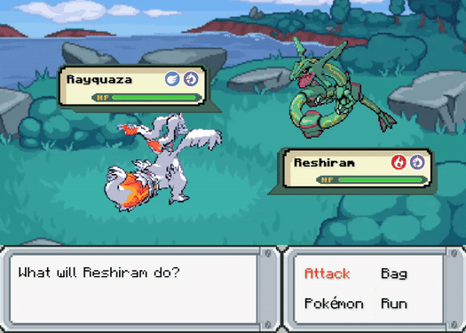

##  Pokemon 


A **Scala-based** game recreating the iconic Pokemon battles from [*Game Freak*](https://bulbapedia.bulbagarden.net/wiki/Game_Freak)

[<u>**Check out the Demo**</u>](https://www.youtube.com/watch?v=dAXEsYox5lI) 🌱

### Pokemon & Moves 🐉
- **100+ Pokemon**: Wide range of Pokemon, each with its *unique stats*.
- **100+ Moves**: From *physical* to *status* moves, offering strategic choices in battle.

### AI Opponents ⚔️
- **Weighted Move Selection**: Select moves factoring in *move effectiveness* and *type advantages*.
- **Smart Switching**: Switches to Pokemon that has *type advantage* over the player’s active Pokemon.



### Running the Game 🎮
If you running `.jar` from [latest release](https://github.com/eesuhn/Pokemon/releases/tag/v1.1), make sure to [check out the doc](./readme-doc/run-jar.md)

Run the following command if you running from source:
```
sbt compile run
```

#### Requirements 🛠️
```
Scala 2.11.*
SBT 1.10.*
Java 17
JavaFX 17.*
```

### Background Work 🛠️
<i>*If you plan to contribute</i>

#### Adding New Pokemon or Moves 🐉
- **Check Pokemon Resources**: <br>
	Run test case to ensure the new Pokemon or Move has the corresponding resources.
	```bash
	sbt "testOnly *ResTest"
	```

- **Assets Automation**: <br>
	Automatically scrap and manipulate assets using `FFmpeg, BeautifulSoup, Pillow`. [Check out the script](https://github.com/eesuhn/pokemon-res)
	- **Sprites**: Extracted from [Pokemon Database](https://pokemondb.net/pokedex/all)
	- **SFX**: Extracted from [SFX Gen 5](https://downloads.khinsider.com/game-soundtracks/album/pokemon-sfx-gen-5-attack-moves-blk-wht-blk2-wht2)
